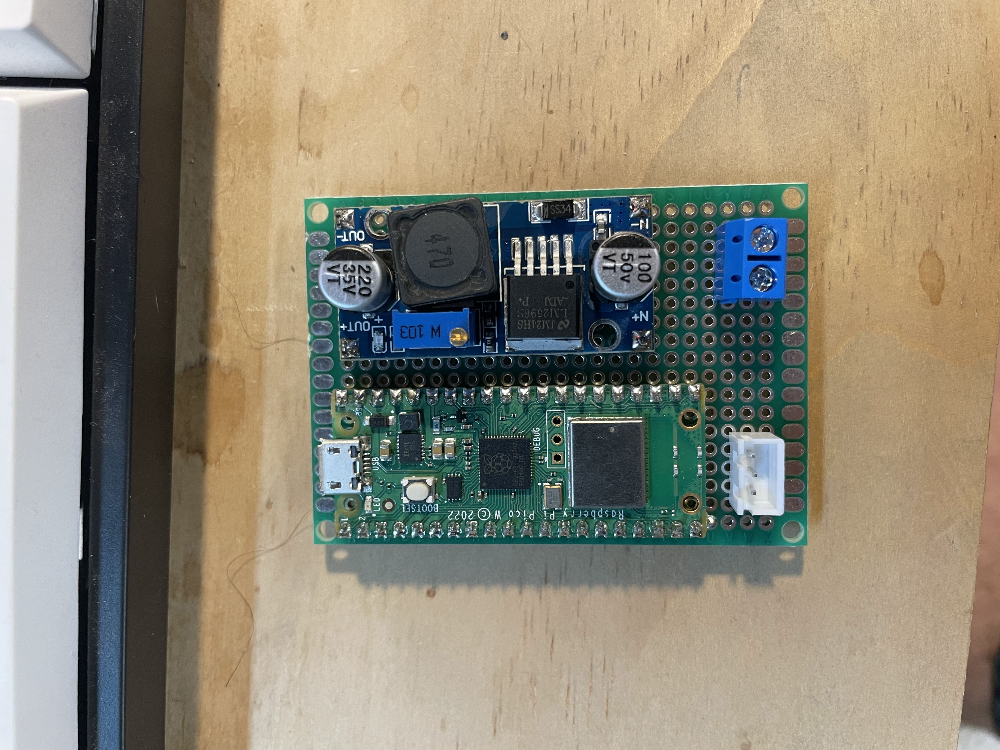
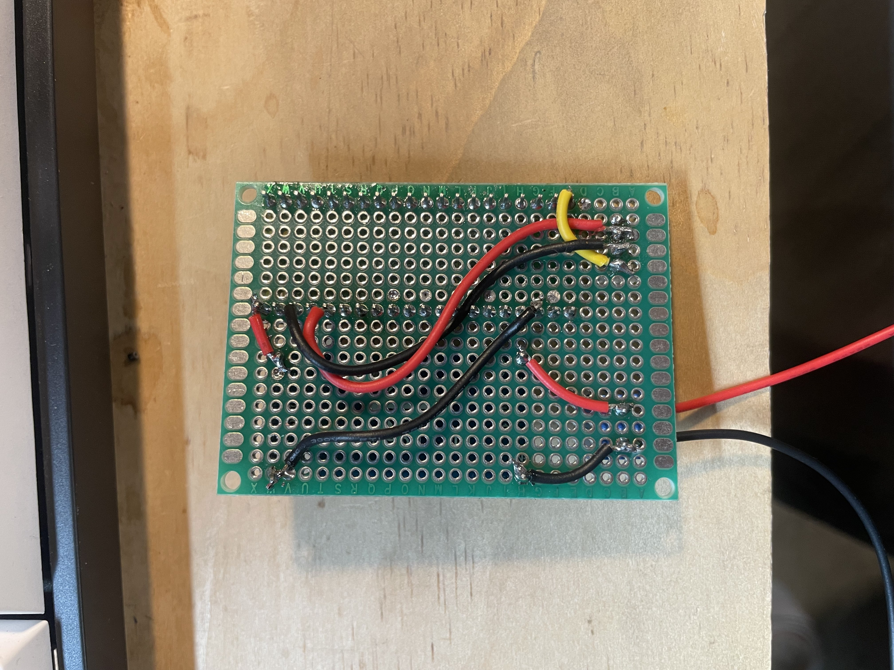
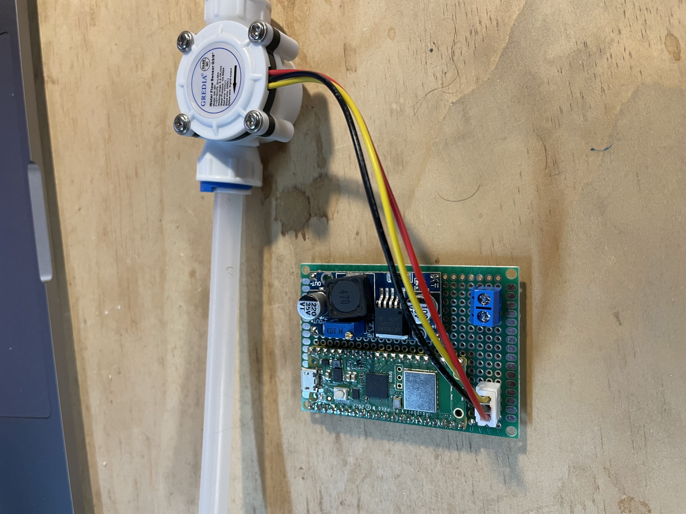

# Van Water Meter Sensor
A Micropython script that starts monitors when water is passing through a flow meter and send that flow amount in gallons to an MQTT client running on a Raspberry Pi for a van systems dashboard.
This uses a [GR-301](https://www.amazon.com/GREDIA-Connect-Food-Grade-Flowmeter-Counter/dp/B07MY7H45V) flow meter but should also work well with the generic YS-201 or most hall effect sensors. The GR-301 has a male 3 wire JST-PH connector on it so I used a female JST connector on some perf board to make a clean installation.
An LM2596 dc-dc voltage converter is used to step the 12v house battery voltage down to 5v to power the Pico W.


## Table of Contents
- [Manual Installation](#manual-installation)
- [Dev Environment](#development-environment)
- [Wiring](#wiring)

## Manual Installation

Clone the repo:

```bash
git clone https://github.com/michaelpappas/WATER_TANK_SENSOR
cd WATER_TANK_SENSOR
```

Replace the SSID and PASSWORD values with your own wifi network.
Modify the "mqtt_server" value for the ip address of the MQTT broker.


## Wiring
Flow meter ground -> pi GND (pin38)    
Flow meter VCC -> pi 3v3 (pin36)    
Flow meter signal out -> pi GPIO15 (pin20)    

Top of board:  



Bottom of board:  



Board with flow meter:  



## Project Structure

```
\                           # project directory
 |--flowMQTT.py             # micropython script for sensing water volume and mqtt
 |--readme.md               # project readme

```


